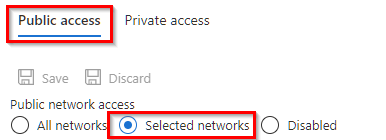

<H1>Private access for Azure resources</H1>

# Introduction 
Traditionally Azure PaaS services like SQL Azure, CosmosDB, Azure Service Bus etc, all expose a public endpoint, which means they are reachable via public internet, using a public IP and/or a DNS name. This could make them vulnerable to various security threats. To make our applications more secure, we would ideally disable the public access and have the PaaS services expose only a private endpoint which is reachable only from our application. 

Take an example of a very simple application in figure:

It consists of an Azure Web App which uses Azure SQL to store it's data. By default, both the WebApp and SQL would be accessible to the public, however, we would not want the SQL to be accessible over the public internet. Instead, we would want to restrict its access and allow only the Azure WebApp to access the SQL database.

# Primary Goals
1. Disable/restrict public access to internal PaaS services like Databases, storage accounts, cache, service bus, etc.
2. Public access should only be provided on customer facing resources like Azure Web App, Azure AppGateway, Traffic Manager.
3. Configure customer facing resources such that they access the internal resources via Azure backbone network and not via the public internet.

# Spikes/Considerations
The Azure cloud provides multiple options for restricting access to PaaS resources. Some of th options were evaluated as a part of this PoC task.

1. Restrict access via Firewall - One can restrict access to any PaaS resource and whitelist one or more Virtual networks(VNets) and/or IP addresses from which the PaaS resources can be accessed. This disables access from general internet and allows access only via the whitelisted elements. 
2. Private Endpoints - A private endpoint is a network interface (NIC) that uses a private IP address from a virtual network. This network interface connects you privately and securely to the internal PaaS service. The connections are routed within the VNet and public internet it completely avoided.
3. App Service Environments (ASE) - ASE was not considered for this PoC.

# Private Access
## Restrict access via Firewall 
Restricting access via Firewall generally works by whitelisting VNets and/or IP addresses from which the resource could be accessed.

This option is generally available in the _Networking_ section of the resource, where you can choose allow access to only _selected networks_.

   - If a VNet is whitelisted, then the public facing resource must be integrated with the VNet
   - Or if a IP address is whitelisted, the public facing resource should have that IP as its outbound IP.

Here are reference links to some of the resource types:

- Azure SQL - [Azure SQL connectivity settings](https://learn.microsoft.com/en-us/azure/azure-sql/database/connectivity-settings?view=azuresql&tabs=azure-portal#deny-public-network-access)
- Azure Cosmos - [Configure IP firewall in Azure Cosmos DB
](https://learn.microsoft.com/en-us/azure/cosmos-db/how-to-configure-firewall?WT.mc_id=Portal-Microsoft_Azure_DocumentDB) and [Configure access to Azure Cosmos DB from virtual networks (VNet)
](https://learn.microsoft.com/en-us/azure/cosmos-db/how-to-configure-vnet-service-endpoint)
- Azure Storage account - [Configure Azure Storage firewalls and virtual networks
](https://learn.microsoft.com/en-us/azure/storage/common/storage-network-security?tabs=azure-portal)
- Azure service bus - [Allow access to Azure Service Bus namespace from specific IP addresses or ranges
](https://learn.microsoft.com/en-us/azure/service-bus-messaging/service-bus-ip-filtering) and [Allow access to Azure Service Bus namespace from specific virtual networks
](https://learn.microsoft.com/en-us/azure/service-bus-messaging/service-bus-service-endpoints)
 
### Notes on High Availability
For High availability (HA), services are configured to be deployed to more than one region (East US and West US). Some observations made while executing the PoC:

- To whitelist VNet, in the HA architecture, we need to create two VNets, one in each region. 
- For Storage Account and CosmosDB Account, it is possible to whitelist both Vnets (i.e., Vnets from multiple regions)
- However, for SQL Server, you can only whitelist the VNets which are in the region same as the database. This is such that you have to have two databases for HA, which are then part of a failover group. However, in this case, when failover group points to East db, for example, the West Web App was not able to access the database, because East db only whitelists East Vnet. Hence, one has to be careful to coordinate failover of application and database at the same time.

## Restrict access via Private Endpoints

A [private endpoint](https://learn.microsoft.com/en-us/azure/private-link/private-endpoint-overview) is a network interface (NIC) that uses a private IP address from your virtual network (VNet). This network interface connects you privately and securely to a service that's powered by [Azure Private Link](https://learn.microsoft.com/en-us/azure/private-link/private-link-service-overview).

**Private-Link Resource**: A private-link resource is the destination target of a specified private endpoint. 

Private endpoints enable connectivity between the customers from the same:

- Virtual network
- Regionally peered virtual networks
- Globally peered virtual networks
- On-premises environments that use VPN or Express Route
- Services that are powered by Private Link

The private endpoint must be deployed in the same region and subscription as the virtual network.

There are limits to the number of private endpoints you can create in a subscription. For more information, see [Azure limits](https://learn.microsoft.com/en-us/azure/azure-resource-manager/management/azure-subscription-service-limits#networking-limits)

## Network security of private endpoints

Private endpoints support network policies. Network policies enable support for Network Security Groups (NSG), User Defined Routes (UDR), and Application Security Groups (ASG). For more information about enabling network policies for a private endpoint, see [Manage network policies for private endpoints](https://learn.microsoft.com/en-us/azure/private-link/disable-private-endpoint-network-policy?tabs=network-policy-portal). To use an ASG with a private endpoint, see [Configure an application security group (ASG) with a private endpoint](https://learn.microsoft.com/en-us/azure/private-link/configure-asg-private-endpoint?tabs=portal).

## Azure Private Endpoint DNS configuration
It's important to correctly configure your [DNS settings to resolve the private endpoint IP address](https://learn.microsoft.com/en-us/azure/private-link/private-endpoint-dns) to the fully qualified domain name (FQDN) of the connection string.

Existing Microsoft Azure services might already have a DNS configuration for a public endpoint. This configuration must be overridden to connect using your private endpoint.

The network interface associated with the private endpoint contains the information to configure your DNS. The network interface information includes FQDN and private IP addresses for your private link resource.

## Storage Account
You can create private endpoints only on a General Purpose v2 (GPv2) storage account.

Private endpoints are not available for general-purpose v1 storage accounts.

